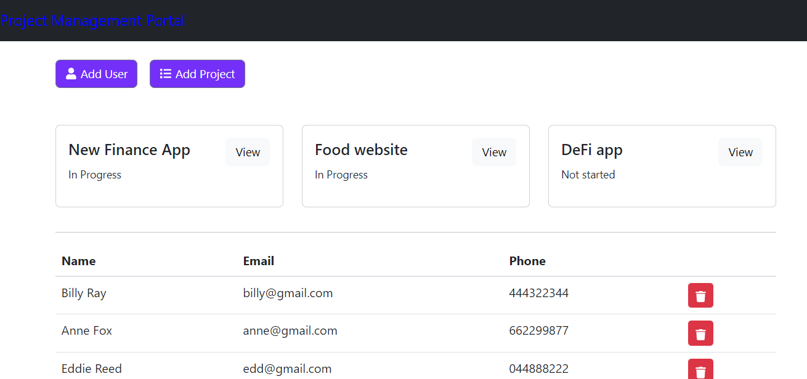

# GraphQL_Projects_Manage

## Table of contents
* [General info](#general-info)
* [Technologies](#technologies)
* [Project Status](#project-status)
* [Future Development](#future-development)
* [Demo](#demo)
* [Installation](#installation)
* [License](#license)
* [Contact Me](#contact-me)

## General info

The application allows a an user to see existing projects and users. It is also possible to add a new user/project and remove or update them.

## Technologies

Project is created with:
* Node.js
* Express.js
* React 
* MongoDB
* GraphQL

## Project Status

* MVP working

## Future Development
* Login and register processes 
* Styling

## Demo

Since the app is not deployed, you can click [here](https://drive.google.com/file/d/1UIBQ941WK78PqER-6nHmsZf4pCOaR37a/view) for a short walkthrough video

## Installation

To run locally the application clone [this link](https://github.com/Nico749/GraphQL_Projects_Manage.git) on your local machine and the run npm start for server and client 
 
## License

Distributed under MIT License. 

## Contact me 

Created by [Nico Pasqualini](https://github.com/Nico749) - feel free to contact me!